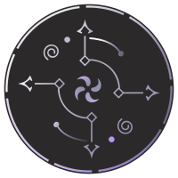
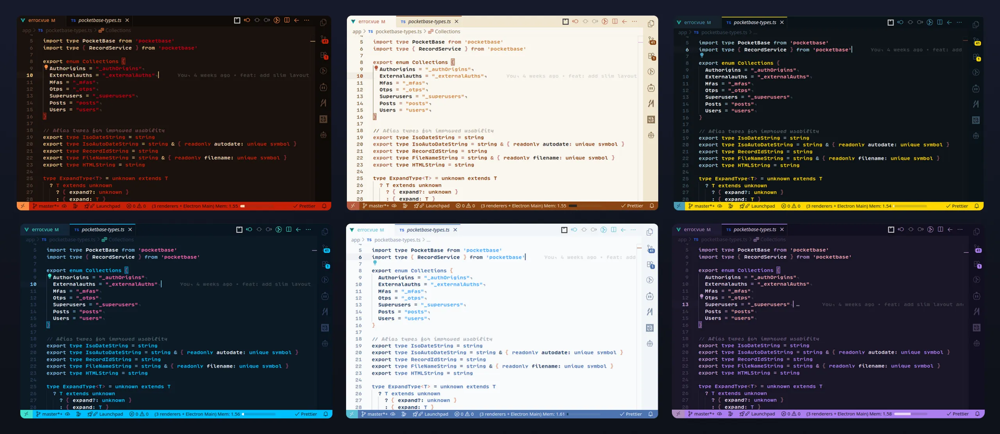

<div align="center">

  <p></p>
  <h1>Genshin Vibes ✨</h1>


  <p>
    <strong>A curated collection of VS Code themes inspired by the aesthetics of Teyvat.</strong>
  </p>
  
  <p>
    <a href="https://marketplace.visualstudio.com/items?itemName=bubaic.genshin-vibes">
      
    </a>
    <a href="https://marketplace.visualstudio.com/items?itemName=bubaic.genshin-vibes">
      
    </a>
    <a href="https://open-vsx.org/extension/bubaic/genshin-vibes">
      
    </a>
    <a href="https://github.com/bubaic/genshin-vibes/blob/main/LICENSE">
      
    </a>
  </p>

  <br />

  

</div>

<br />

## 🌌 Overview

**Genshin Vibes** brings the atmosphere of Teyvat's elements and Archons directly to your editor.

Each theme is **hand-tuned** for long coding sessions:

- ☯️ **Balanced Contrast** – Easy on the eyes, day or night.
- 🎨 **Expressive Accents** – Colors that pop and identify the character's element.
- 🌗 **Perfect Pairs** – Every Dark theme has a carefully crafted Light companion.

<br />

## 🎭 Theme Collection

Currently featuring **20 themes** (10 pairs) covering Archons, Harbingers, and Travelers.

| Character        | 🌚 Dark Variant        | 🌞 Light Variant     |
| :--------------- | :--------------------- | :------------------- |
| ⚡ **Raiden**    | Eternal Electro Throne | Violet Eternity Glow |
| 🌿 **Nahida**    | Verdant Dreamweave     | Kusanali Dawnbloom   |
| 🔶 **Zhongli**   | Geo Contract Vault     | Morax Golden Seal    |
| 💧 **Furina**    | Hydrocourt Midnight    | Fontaine Spotlight   |
| 🍃 **Venti**     | Stormrider Breeze      | Celestine Bardlight  |
| 🔥 **Mavuika**   | Lava Glaze Inferno     | Sunforge Ember       |
| ❄️ **Citlali**   | Frost Ritual           | Ice Oracle           |
| 🕊️ **Columbina** | Veiled Harbinger       | Damselette Whisper   |
| 🏹 **Amber**     | Outrider Blaze         | Pyro Scout           |
| 🍙 **Paimon**    | Emergency Food         | Starry Companion     |

<br />

## 📥 Installation

1. Open **Visual Studio Code**.
2. Go to **Extensions** (`Ctrl+Shift+X` / `Cmd+Shift+X`).
3. Search for **Genshin Vibes**.
4. Click **Install**.
5. Reload and pick your vibe via `File > Preferences > Color Theme`.

### ⌨️ Command Line

```bash
code --install-extension bubaic.genshin-vibes
```

## 💬 Feedback & Requests

Found a bug? Want a new character or variant?

👉 [Open an Issue on GitHub](https://github.com/bubaic/genshin-vibes/issues)

Niche characters and Harbingers are welcome. 😜

<br />

---

<div align="center">
  <span>Made with ❤️ by <i>a Traveler, for Travelers</i>.</span><br>
  <sub><b>Ad Astra Abyssosque</b></sub>
</div>
