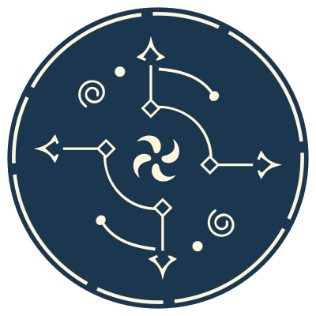
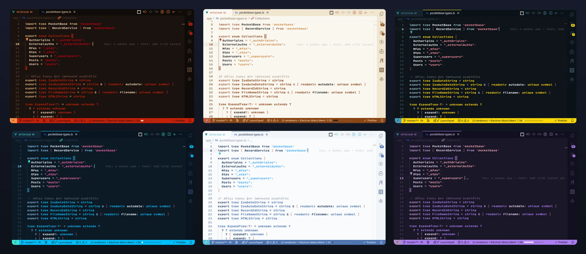

<div align="center">

  <div>
    
  </div>
  <h1>Genshin Vibes</h1>

  <p>
    <strong>A curated collection of dark and light VS Code themes inspired by the aesthetics of Teyvat from Genshin Impact.</strong>
  </p>

  <div style='dsplay: gap: 4px;'>

[](https://marketplace.visualstudio.com/items?itemName=bubaic.genshin-vibes)
[](https://marketplace.visualstudio.com/items?itemName=bubaic.genshin-vibes)
[](https://open-vsx.org/extension/bubaic/genshin-vibes)
[](https://github.com/bubaic/genshin-vibes/blob/main/LICENSE)

  </div>

  <br />

  

</div>

<br />

## 🌌 Overview

**Genshin Vibes** &mdash; A character-inspired theme system designed around mood, contrast, and long-session readability.

What you get:

- **Balanced Contrast** — comfortable for extended coding sessions
- **Expressive Accents** — used sparingly to signal meaning and intent
- **Perfect Pairs** — designed as complements, not inverses

<br />

## 🎭 Theme Collection

Currently featuring **24 themes** (12 pairs) covering Archons, Harbingers, and Travelers. Each theme uses a distinct status bar color as a character identity anchor.

| Character     | Dark Variant           | Light Variant        |
| :------------ | :--------------------- | :------------------- |
| ⚡ Raiden     | Eternal Electro Throne | Violet Eternity Glow |
| 🌿 Nahida     | Verdant Dreamweave     | Kusanali Dawnbloom   |
| 🔶 Zhongli    | Geo Contract Vault     | Morax Golden Seal    |
| 💧 Furina     | Hydrocourt Midnight    | Fontaine Spotlight   |
| 🍃 Venti      | Stormrider Breeze      | Celestine Bardlight  |
| 🔥 Mavuika    | Lava Glaze Inferno     | Sunforge Ember       |
| ❄️ Citlali    | Frost Ritual           | Ice Oracle           |
| 🕊️ Columbina  | Veiled Harbinger       | Damselette Whisper   |
| 🏹 Amber      | Outrider Blaze         | Pyro Scout           |
| 🍙 Paimon     | Emergency Food         | Starry Companion     |
| 🩸 Arlecchino | Knave's Shadow         | Dire Balemoon        |
| 🐉 Xiao       | Yaksha Vigil           | Conqueror of Demons  |

<br />

## 📥 Installation

1. Open **Visual Studio Code**.
2. Go to **Extensions** (`Ctrl+Shift+X` / `Cmd+Shift+X`).
3. Search for **Genshin Vibes**.
4. Click **Install**.
5. Reload and pick your vibe via `File > Preferences > Color Theme`.

### ⌨️ Command Line

```bash
code --install-extension bubaic.genshin-vibes
```

<br/>

## 💬 Feedback & Requests

Found a bug? Want a new character or variant?

👉 [Open an Issue on GitHub](https://github.com/bubaic/genshin-vibes/issues)

Requests for niche characters and Harbingers are welcome. 🎎

<br />

---

<div align="center">
  <span>Made by <i>a Traveler, for Travelers</i>.</span><br>
  <sub><b>Ad Astra Abyssosque</b></sub>
</div>
